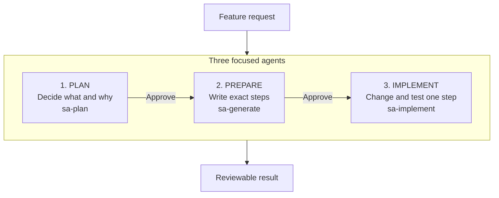

# Structured Autonomy: Why We Use Custom Agents

> **Short version:** A custom prompt asks for one focused result. A custom agent owns a stage of work, with defined tools, boundaries, handoffs, and review checkpoints.

## Workflow at a Glance

This repository separates deciding, preparing, and doing so implementation never starts from an unreviewed idea.

## Custom Agents vs. Custom Prompts

| Custom agents - used for delivery | Custom prompts - useful for one focused task |
|---|---|
| Own a clear role for one stage of work | Package a reusable request for one result |
| Use stage-specific tools and boundaries | Usually inherit the current agent and its tools |
| Pass decisions through `plan.md` and `implementation.md` | Usually return one response in the current chat |
| Stop at explicit review checkpoints | Finish the requested task in one pass |
| Best for planning, handoffs, implementation, and validation | Best for drafting a PRD, summary, template, or standard response |

## What We Gain

| Better output | Lower token usage |
|---|---|
| Research and scope are settled before code changes | Decisions are written once instead of repeated in every prompt |
| An approved plan becomes the source of truth | Each stage loads only the context and tools it needs |
| Exact implementation steps reduce interpretation gaps | The builder uses the handoff instead of repeating broad research |
| One small step is changed, validated, and reviewed at a time | Less rework means fewer corrective conversations |

> **Token note:** Agents do not automatically make every request cheaper. The savings come from scoped context, durable handoffs, and avoiding rework.

## Why Each Agent Exists

| Agent | Plain-language job | Guardrail |
|---|---|---|
| `sa-plan` | Research the request and decide what should change | Writes only the plan; does not change product code |
| `sa-generate` | Turn the approved plan into exact, executable steps | Writes only the implementation guide; does not build or test |
| `sa-implement` | Apply and validate the next small step | Stops after one step so the result can be reviewed |

## Presenter Takeaway

**Use a custom prompt when:** the task is focused and one good response completes it.

**Use custom agents when:** the work needs separate responsibilities, controlled tools, durable handoffs, and review gates.

**Bottom line:** Prompts standardize a request. Agents standardize responsibility and execution.